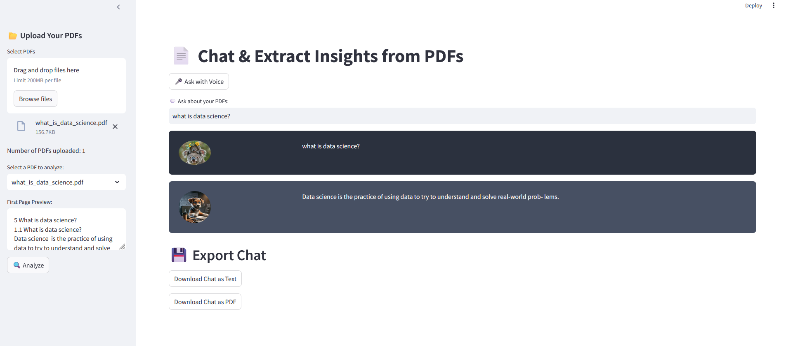

# PDF AI Chat: Interactive Q&A with Hugging Face & LangChain

PDF AI Chat is a Python-based application that allows users to upload multiple PDFs and ask questions about their content. It uses a language model to generate answers but is not designed for open-ended conversations, so it may not respond to greetings or engage in complex reasoning.

For more natural interactions, a more powerful GPU (which speeds up processing of the FLAN-T5-large model on HuggingFaceHub) or access to premium models like OpenAI’s is required. Upgrading to GPT-4, combined with a GPU, would enhance performance, enabling more complex and human-like responses. Currently, the FLAN-T5-large model on a CPU may limit performance. Using a GPU or OpenAI’s advanced models improves both processing speed and language understanding.

Accessing a GPU and OpenAI’s models requires payment. Once paid, adapting the provided code for use with these resources would be straightforward, offering improved performance and the ability to handle more sophisticated queries.

## Video Demonstration of the App on YouTube

To give you a quick overview of how the app works, I’ve created a demonstration video. While setting up the app locally can take a few minutes and sometimes lead to dependency issues, this video allows you to experience the website without any setup.

Additionally, I am actively working on hosting the app on a cloud platform to make it even easier to access.

## Logic of the App (Backend explanation)

The application works through the following steps to generate answers the questions:

1. **PDF Upload**: The app reads multiple PDF files and extracts the text content from them.

2. **Text Segmentation**: The extracted text is broken down into smaller, manageable sections for efficient processing.

3. **Language Model**: A language model is used to create vector representations (embeddings) of the text segments.

4. **Similarity Matching**: When you ask a question, the app compares it to the text segments and finds the ones most semantically similar.

5. **Answer Generation**: The relevant text chunks are passed to the language model, which formulates a response based on the extracted information from the PDFs.

## Frontend

It is possible to:

- Upload multiple PDF files
- Select a specific PDF for targeted questions
- Review the first page of any PDF
- Ask questions by typing or speaking
- Export the answers in either text or PDF format

## Installation and Use

1- Copy the repository to your local machine by cloning it.

2- Install the necessary dependencies by executing this command: pip install -r requirements.txt

3- Get an HuggingFace key from HuggingFace and add it to the .env_secret file in the project directory: (change the name of the file to .env otherwise it will not work)

HUGGINGFACEHUB_API_TOKEN= your_API

4- Run the app using this command : streamlit run app.py

5- The app will open in the browser, and then upload documents and ask questions about it.

